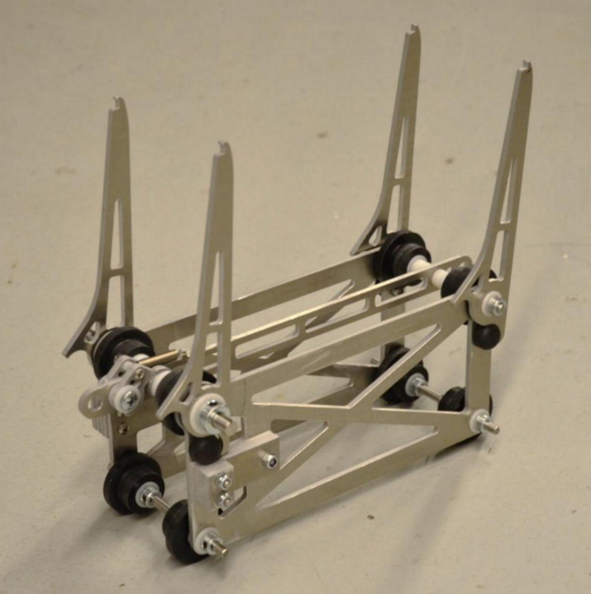
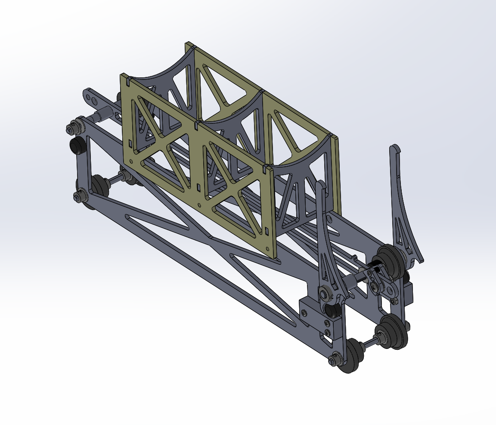
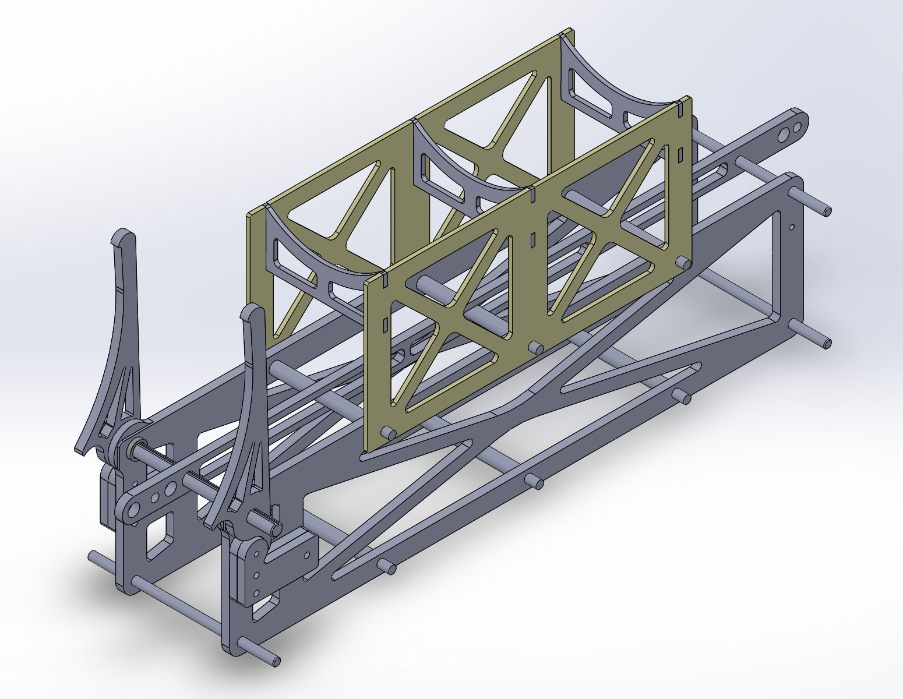
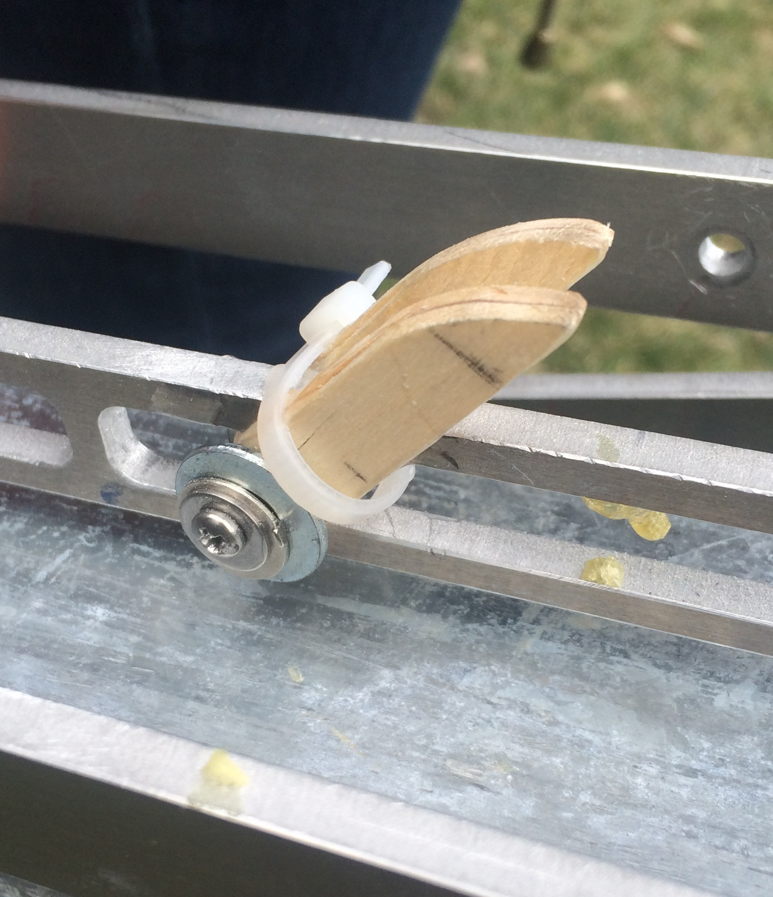
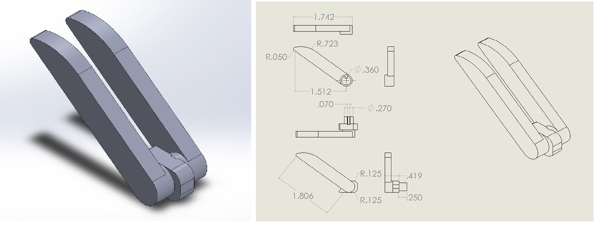

Catapult
=========

.. contents::

Additional information, including BOM and Design paper, can be found at the catapult github repository: https://github.com/CUAir/catapult

Overview
---------

The catapult cart is the direct interface between the catapult and the aircraft. Its design is critical for successful takeoff.

The cart is composed mainly of aluminum sheet metal which has been water-jet cut to shape. The geometry of the cart adds strength in the needed locations while keeping mass to a minimum. Two identical side plates serve as the primary mounting surfaces for the cart's various interfaces as well as large stopping bloacks that contact the frame damper springs and distribute the loads present during deceleraion. Four shafts contain a total of eight wheels that ride along the corners of the frame. An additional piece known as the pin tension member spans the top two shafts. A carabiner connects this member to the cable at the front of the cart. At the back of the pin tension member is a hole that interfaces with the safety pin.

The cart frame experiences its highest loading upon impact with the spring stoppers. It must decelerate from 15 m/s to rest in about 5.7 cm. This is a deceleration of approximately 200 G. Since all of the force of the deceleration is applied to the stopping blocks, they have to sustain an average force of approximately 1000 N (225 lb) each. Thus, ensuring that the cart's connections fully constrain the aircraft from undesired motion is a high priority in all present and future design changes.

Icarus / Eos Interface
-----------------------

The original design of the cart was created for Eos. Its interface comprises of four arms fit to the top two shafts in the cart. The front two arms are connected to a ratcheting mechanism that constrain them in place until the cart reaches the end of its track, restraining the plane in place as the throttle is applied. At the end of the track, the ratchet is released and the arms pivot about the cart shafts. During launch, they exert a force on the plane at their tips. The moment created by the force of the plane is balanced with the use of four rubber bumpers mounted to the cart walls. Upon impacting the damping springs, the arms rock forward and bounce off the bumpers, allowing them to gently come to rest.

In its final iteration, the cart was 1.0 kg and 12.5" in length.

The interface between the arms and the plane was designed to lock into the plane during acceleration and slide away during detachment. All four arm tips fit into small holes cut into the bottom of the plane. Icarus was designed with a Kevlar fuselage embedded with high-strength garolite plates laser-cut to conform with the arms of the cart. During acceleration, the plane has a tendency to pitch up since the horizontal forces are being applied below the center of mass. To prevent this pitching response, the front two arms feature small hooks that grip the fuselage skin. The back arms only require small nubs that interface with the fuselage holes since the pitching tendency acts to push them further into the holes. Upon detachment, the arms pivot out of the holes and the plane continues in straight-line motion.

Odysseus Interface v1.0
-------------------

The interface designed for Odysseus required significant modification to the existing Eos cart design. While existing mechanisms like the fitted launch arms and the pin tension member were retained, new mechanisms such as the cradle were introduced to the cart in this iteration.

Foremost, the cart's side plates and the pin tension member were extended to 18.5" in length. Additional changes made to the weight reduction design for three holes, the back two 0.375" in diameter and the front 0.19" in diameter, on the top side of each side plate. These holes were included to attach the cradle as well as facilitate future interface designs as needed.

The cradle provides a surface that is stable enough to constrain the aircraft during acceleration while smooth enough to allow for clear removal from the cart. It is comprised of two side plates, three ribs, and a polycarbonate cover. Each rib pieces into the side plates and is held in place by the side plate's connection to the three mounting holes on the cart itself. These plates are bolted through 4 18-8 machine screws in each of the back two holes and a 8-32 machine screw in each front hole. The polycarbonate cover is attached to the upper surface of the finished cradle assembly via wet cement or gorilla glue.

Odysseus Interface v1.1
---------------------

As of May 2016, significant modifications have been made to the Odysseus interface and base cart. The thickness of the base cart's side plating, the pin member, and the front cart arms have been increased from 3/16" to 1/4". After observations of parallel plate motion in field testing, six perpendicular rods have been incorporated into the cart into to restrict parallel plate motion. The upper three of the rods have replaced the the machine screws which piece the cradle to the base cart. The stopper pieces for the front cart arms and the launch arm's springs have been merged into one piece called the stopper. Testing of these cart modifications has yet to be conducted.

Bixler Interface
-----------------

The interface developed for the Bixler 3 test plane consists of two sloped extended shafts that piece into a channel cut in the bottom of the Bixler's fuselage. Initial development consisted of two wooden tabs cut to ~2" and sloped on their upper edge. These tabs are connected by means of an single 8-32 machine screw, locknut, and a mirrored washer arrangement threaded through the centered pin member of the cart. 

This assembly is functional in securing the Bixler to the catapult throughout launch; however, several improvements are needed for further use. Issues that have arisen in testing thus far include: failure to constrain lateral motion, excessive tearing of the Bixler's fuselage, and complete mechanical failure. Foremost, 3D printing of the functional assembly into a single or two interlocking parts has been explored and should be fabricated for future use. Conceptual CAD schematics for a new Bixler interface are pictured below and are available on the Mechanical Subteam's Cornell Box.

Control System
--------------

The following describes the catapult control system. The microprocessor used for control of the catapult is the Adafruit Pro Trinket 5V/16MHz. The latest version of the control code can be found at https://github.com/CUAir/catapult/blob/master/catapult.ino

How to Flash the Arduino
^^^^^^^^^^^^^^^^^^^^^^^^
Dependencies:
Arduino Liquid Crystal Library
http://playground.arduino.cc/Main/LiquidCrystal

1. Prepare your IDE to be compatible with the Adafruit trinket. Follow these instructions: https://learn.adafruit.com/adafruit-arduino-ide-setup/overview
2. Clone the git repository and make any necessary edits using the Arduino IDE.
3. Plug in FTDI cable to the pins on the front of the control box and to a USB port on your computer.
4. Under the Tools menu, set the Board to the Pro Trinket 5V/16MHz (FTDI) and set the Programmer to USBtinyISP
5. Check that the IDE recognizes the Arduino COM port by the presence of a check next to the COM port in the Tools>Serial Port menu.
6. Compile the code by pressing the check-mark icon in the top left corner
7. Upload the code to the Arduino by pressing the arrow icon in the top left corner

Description
^^^^^^^^^^^
The control code is structured as a state machine - to allow for distinct states like pressurizing and primed and especially for added safety. Please refer to the source code for a detailed descriptions of each state. See operation section for operation instructions.

The catapult control software has several functions. It controls the behavior of the compressor and the launch valve, it shows diagnostic information to the operator, and it enacts several safety measures to prevent accidents. Battery voltage and current/target pressure are displayed to the user. User input determines what value to pressurize to, when to pressurize, and when to launch.

The raw values of the pressure and battery voltage readings are mapped by constants that were measured by hand. The battery voltage mapping is a direct scale factor of 0.012289, in the code it is the constant 'battVoltageFactor'. The pressure mapping is more complex. The value displayed to the user is the direct reading from the transducer, but an altered value is used to determine when to stop compressing because there are fluctuations in pressure readings while the compressor is on. These fluctuations are larger at higher pressures, so a jitter value is determined based on a scaling down of the target pressure. The compressor stops when the pressure reading minus the jitter value is equal to the target pressure. This was thoroughly tested and shows excellent results. The jitter value is a linear mapping of the range 0-150 (target pressure) to 3-10. If altering the code, under no circumstances should the upper pressure threshold (read from the potentiometer) be raised above 150. Refer to source code for further comments.

	
- init - Initialize: default state, displays warning to user and initializes sensors
- dSP - Pressure Set Display: Displays the text template to for pressure to the screen and then sets state to SP
- SP - Set Pressure: Displays potentiometer data to the screen and saves value to pressure variable. On press of the pressurize button, sets state to dPress.
- dPress - Pressurize Display: Displays template for pressure and battery diagnostics
- Press - Pressurize: Turns on pump, displays current pressure, goal pressure, and battery voltage. When current pressure = goal pressure, sets state to Primed.
- Primed - Primed: Turns off pump, displays pressure and battery stats and turns on launch LED. On pressurize button push, returns to dPress. On launch switch, sets state to Fire.
- Fire - Launch Catapult:  Opens servo, waits launch duration, closes servo. (fires catapult). Turns off launch switch LED and sets state to dSP

Software safety mechanisms
^^^^^^^^^^^^^^^^^^^^^^^^^^
- Device will never pressurize to values above 150 psi. 
- Software makes sure that the launch valve is closed before comprpession begins. 
- System cannot launch without primed LED (on the launch switch) being on.
- Debouncing disregards false launch and pressurize readings.
- Screen shows warning messages upon initialization.
- Battery voltage displays 'CRITICAL' when voltage is below 11.45V
- State machine design ensures that launch CANNOT occur if not in the primed state.

Operation Instructions
----------------------

Setup
^^^^^
1. Catapult should typically be set up to launch into the wind. Catapult box must be set up next to the catapult and must open towards it, plan accordingly and place the box in the correct location.
2. Remove two main parts of the catapult (large metal extrusions). Unsecrew the thumbscrews from the back portion and unwrap the cord from the front portion. Unfold the legs of the front piece and insert the respective pins. 
3. Slide the catapult cart onto the back piece in the correct orientation. 
4. Insert the back piece into the front piece and screw the thumb screws in. Make sure they are screwed in tight and have someone double check that this is the case.
5. Connect carabiner to catapult cart. Insert safety pin into the back of the catapult
6. Connect the longest tube from the pressure tank to the front of the catapult. Connect compressor tube to the catapult box.
7. Unspool ethernet cord, connect one end to catapult box and the other end to the control box, lay box far away, behind and to the side of the catapult.
8. Connect compressor power cable and connect 12V battery cable to catapult box. 

Operation
^^^^^^^^^
1. Turn the system on by turning the key to the on position.
2. Read warning displayed on control box.
3. Make sure that the safety pin is in place before proceeding.
4. Turn pressure dial until the screen displays the desired target pressure.
5. Announce that you are pressurizing the catapult and press the pressurize button. 
6. Once the compressor is finished pressurizing, the LED on the launch switch will turn on. This means that the catapult is primed and ready to fire. Do not lift the switch cap unless you are prepared to fire.
7. Have someone else pull out safety pin.
8. When everyone is ready, lift switch cap and toggle the launch switch to fire. 
9. Once the plane has launched, send two or three people to remove the catapult from the runway. 
10. To launch again return to step 3, otherwise turn the key to the off position and pack up the device.
