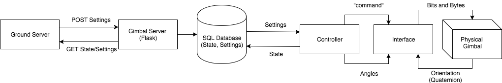

.. CUAir Distributed Systems Documentation documentation master file, created by
   sphinx-quickstart on Mon May  2 11:28:43 2016.
   You can adapt this file completely to your liking, but it should at least
   contain the root `toctree` directive.

Gimbal Server
============================

.. contents::

This section provides the use and design of the distributed systems gimbal server.

Overview
----------------

The CUAir gimbal server provides an HTTP interface for changing camera gimbal settings and reading gimbal state/settings.

**Full documentation of the 2016-2017 Gimbal Server API can be found** `here <http://docs.cuair20152016gimbal.apiary.io/>`_.

The gimbal server is built using the Flask web framework in Python.

Gimbal Hardware
----------------------------
The gimbal that will be used for the 2017 SUAS Competition is the `Basecam Electronics SimpleBGC 32-Bit <https://www.basecamelectronics.com/simplebgc32bit/>`_.

* A third party gimbal board used in conjunction with the server application to control and point the plane camera.

* Interface written in Python (with PySerial)

* `User Manual (English) <http://www.basecamelectronics.com/files/v3/SimpleBGC_32bit_manual_2_5x_eng.pdf/>`_

* `Serial Protocol Specification (ver. 2.5x) <http://www.basecamelectronics.com/files/SimpleBGC_2_5_Serial_Protocol_Specification.pdf/>`_

* NOTE: Due to what appears to be an error in the firmware, setting a motor axis as inverted in the GUI does not actually invert the axis. As a result, a negation was added any pitch angle sent to the board so that the gimbal follows a North-East-Down frame.

Gimbal System Flow
----------------------------

* The ground server acts as the client and sends GET and POST requests to the Flask Gimbal Server.

* The Gimbal Server processes these requests by either responding with the Gimbal state or updating the settings in the SQL Database. (See "Settings and States" in Ground Server for more information).

* The Controller is layer between database and gimbal interface. It contains an update loop which queries the setting table to determine and send appropriate target angles to the SimpleBGC as well as polling the current IMU angles of the gimbal and adding a corresponding state object to the state table.

* The Interface module provides a serial interface for communication with the SimpleBGC 32-bit board.
