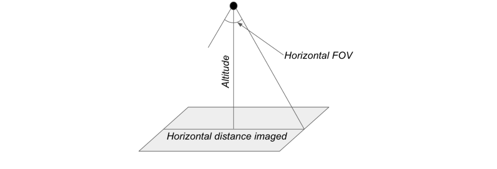

.. CUAir Distributed Systems Documentation documentation master file, created by
   sphinx-quickstart on Mon May  2 11:28:43 2016.
   You can adapt this file completely to your liking, but it should at least
   contain the root `toctree` directive.

Ground Server
============================

.. contents::

This section provides the use and design of the distributed systems ground server.

Overview
----------------

The CUAir ground server is designed to fulfill two tasks: target detection/localization and delivering a care package (airdrop). In order to fulfill these tasks, the ground server must keep track of and store various settings and states. More importantly, it should be able to handle client requests reliably.

**Full documentation of the 2016-2017 Ground Server API can be found** `here <http://docs.cuair20162017groundserverapi.apiary.io/>`_.

The ground server is built using the Play web framework in Java. It’s an MVC framework that separates the logic for the view (our frontend), controller (API endpoints that allow clients/servers to communicate with us), and model (interfacing with the database layer, running any algorithms or business logic).

Ground Server Features Overview
--------------------------------

* Tagging (Tagging page of UI):

  * TargetSighting creation

    * User tags an image by right clicking, moving the mouse until the red circle covers the entire target sighting. Make sure that red radius line is pointed towards the direction that the target is facing, and then left click again.
    * Check Target sighting in postgres database:

      * has an associated geotag
      * tagged portion of image is displayed in target sighting object

  * User enters the alphanumeric character, alpha color, shape, and shape color of the target into the respective fields within each target sighting object.
  * User can

      * save a target sighting

        * Saved target sightings from tagging page are displayed on merging page with the corresponding target information (alpha, alpha color, shape, shape color)

      * zoom in and out of image on tagging page by left clicking on the image
      * remove target sightings
      * use ‘next’ and ‘previous’ buttons to move from one image to the next
      * only view the images sent to his computer, not another client’s computer
      * receive a new image from the ground server upon clicking ‘next’ when viewing his most recent image

        * This creates a new assignment (assigned to MDLC) in the database

  * When user is done processing (clicks next for another image), assignment is marked as done
  * All images sent to the ground are processed

* Merging (Merging page of UI):

  * All unassigned target sightings are displayed in the right sidebar
  * User can drag a sighting from the sidebar to an empty target or the “new target” field, and the sighting will be displayed in the target with the correct target information displayed.
  * User can:

    * drag a sighting to an existing target

      * Target object will be updated in postgres database
      * It’s corresponding geotag is also updated

    * un-assign a sighting from a target by dragging the sighting from a target to the unassigned target list.
    * create an empty new target

      * Target object will be created in postgres database

    * remove one target at a time by clicking the “x”
    * save a target
    * export the targets (all at once) by clicking “export targets” at the bottom of the page, creating a .txt file with all of the target information

* Camera (+ Camera page of UI):

  * User can change (within appropriate ranges):

    * Brightness
    * Shutter Speed
    * Gain
    * Frame Rate
    * Whether the camera is capturing photos

    * User can save the camera settings and this will update the settings of the actual camera
    * Camera settings objects are being created in postgres database
    * User can see the most recent image captured by the camera
    * If camera is capturing images, they are being saved to /ground-server/plane/files/plane/
    * Image objects are being created in the postgres database
    * Corresponding telemetry and gimbal data objects are being created in the postgres database

* Airdrop Settings (+ Airdrop and Gimbal page of UI)

  * User can indicate:

    * Arm status
    * Target latitude
    * Target longitude
    * Target threshold

  * User can save airdrop settings
  * When user updates above fields, these settings are sent up to the airdrop server
  * Airdrop setting object is created in database
  * User can enable a manual airdrop override
  * User can override the airdrop (when arm status is true and manual airdrop override enabled) and the payload is immediately dropped

* Gimbal Settings (+ Airdrop and Gimbal page of UI)

  * User can indicate:

    * The longitude and latitude of a coordinate on the ground that the camera should point at (only valid when mode is gps)
    * The pitch and roll of the gimbal (only valid when mode is angle)
    * The mode of the gimbal (‘retract’, ‘ground’, ‘gps’, ‘angle’)

  * User can save gimbal settings
  * Gimbal settings object will be created in database
  * Settings will be sent up to gimbal server

* Geotag test (only during test flights)

  * Record GPS coordinates of targets in field
  * Make sure target GPS coordinates are within 50ft

* Reconnection

  * Settings are queued when ground server disconnected from plane servers
  * Once connection re-established, settings are sent back up to plane

System Design
-------------

Models
^^^^^^^

The models define the data and the relationship between data.
Below is a class diagram of the ground server models. One can see the one-to-one as well as many-to-one relationships (more in next section).

.. image:: images/ground-server-diagram.png

Many-to-One Relationship

.. image:: images/many-to-one-diagram.png

The above figure demonstrates the “one-to-many” relationships between the ground server abstractions. Each image has multiple assignments, which are distributed among various clients, and each assignment can have multiple target sightings.

While this accurately represents the relationship among our abstractions, our software design takes a different approach:

* Target Sighting

  * Assignment

    * Image

* Target Sighting

  * Assignment

    * Image

* Target Sighting

  * Assignment

    * Image

In this approach, we see that there is a “many-to-one” relationship between TargetSighting and Assignment, and between Assignment and Image. The reason we take this approach rather than “one-to-many” is that for one, many-to-one is much simpler and cleaner to serialize into an SQL database. For example, if a single row of the Assignment table stored a single Assignment, we can have one column that is a foreign key to the corresponding row of the Image table. In SQL, we cannot create a schema where we store a list of foreign keys of all the TargetSightings that were created from that assignment. Additionally, this design accurately follows the principle of abstraction in Object Oriented Programming. An Image object only knows about image data, so the process of taking images and scheduling them to different clients is abstracted out from the Image object because the Assignment object contains that information. Similary, the Assignment object knows about the Image that was given to a particular client, but the objects that are found in that image are abstracted out from the Assignment object because the TargetSighting object contains that information. 

The ground server models are used to store data in a SQL database through serialization. The ground server utilizes `Ebean <http://ebean-orm.github.io/>`_ to handle this serialization. Ebean is an Object Relational Mapping (ORM), which is a Java library that allows us to execute SQL commands on our database tables.

Controllers
^^^^^^^^^^^

The controllers in an MVC framework are responsible for handling requests from the view (frontend application) and fetching the desired information from the desired model. The play framework has a routes file that creates a mapping from an HTTP endpoint to the Java method that handles the response to that endpoint. Therefore, controller methods take the HTTP request, fetch the corresponding information, and wrap the information into an HTTP response. The play framework makes it easy to fetch data from the HTTP request (like the request's body and uri), and package the desired information into an HTTP response. The controller methods also utilize the client and dao methods, which we will talk about below.

Database Accessor Objects
^^^^^^^^^^^^^^^^^^^^^^^^^

For each model in the ground server, there exists a database accessor object, or DAO. DAOs utilize Ebean methods to retrieve data from the SQL database. DAOs are an abstraction around accessing the the database from the controller, as many of the methods used to retrieve data are similar across the controllers (get, create, delete, update). The DatabaseAccessor class combines these methods into one interface that allows us to handle these requests for any CUAirModel. When we want to make more complicated requests, we can simply extend the DatabaseAccessor class and add the necessary method (i.e. retrieving all target sightings for a certain image). The DAO abstraction is also useful as it prevents controllers from accessing the database directly. So, if we need to migrate to another ORM or library, we will simply need to modify the DAOs rather than the controller code, which would be more complex. By abstracting out database calls into it's own logical component, our ground station is more modular. 

Clients
^^^^^^^

During the competition, the ground server has to send data to various servers (our servers on the plane and the judge server). The client abstractions are designed to create requests to get and set settings and state of the plane servers (Gimbal, Camera, Airdrop, Autopilot) and send target data to the judge server. Due to the possibility of a failed connection, the client abstractions include threads separate to the application thread that are meant to continue trying to send requests to the other server until a non-timeout response is received.

The underlying pattern with the Client abstractions is that we have a client class for each server on the plane (Gimbal, Airdrop, Camera).

ImageClient is a unique case which involves obtaining information from Autopilot and the Gimbal in order to get the telemetry data for a particular image. Since all of the plane servers are on the same onboard computer, any timestamps that each server makes are all relative to the same clock. This plane timestamp, therefore, can be taken from the Image and used in the queries in AutopilotClient and GimbalClient in order to get the gimbal data and autopilot data at around the time when the picture was taken. ImageClient runs two parallel threads which attempt to get autopilot telemetry data and the gimbal state for an image, respectively.

Client Class Diagram
********************

.. image:: images/client-class-diagram.png

The Client abstraction simply defines a thread that continuously executes run().

The SettingsClient abstraction contains a queue of requests and extends Client. The setSettings() method, which is called by the Client, will add the request to the queue and return a 200 response as an indication that the request was successfully received and is currently being processed. When it is run, it will poll the queue and attempt to send the request (if any) to the server. Once a 200 response is received in the thread, indicating that the settings were successfully sent to the server, the update gets reflected on the front-end. This is extended by CameraClient.

StateSettingsClient, which extends SetttingsClient, allows one to get state. This is extended by AirdropClient and GimbalClient.

AutopilotClient simply gets autopilot telemetry data at a particular timestamp and has no concept of changing the settings or state. Therefore, it is not extended by any client abstractions.

ImageClient is a unique case which involves obtaining information from Autopilot and the Gimbal in order to get the telemetry data for a particular image. Since all of the servers are on the same computer, they have the same timestamp. This timestamp, therefore, can be taken from the Image and queried for in AutopilotClient and GimbalClient. ImageClient runs two parallel threads which attempt to get autopilot telemetry data and the gimbal state, respectively.

Settings and States
*******************

The "state" is information that the plane inherently knows that the ground server cannot directly change but can certainly query for. The plane settings, however, are directives of the plane and can be changed by the ground server. A change in setting can and does induce a change in state. The state and the settings breakdown for the plane servers as follows:

* **Airdrop Server**

  * State: Whether the drop has occured or not (the ground server can try to arm/override but only the plane knows whether the physical mechanism was activated)

  * Settings: Target latitude and longitude, acceptable threshold for drop accuracy, arm and disarm, override drop

* **Gimbal Server**

  * State: The quaternion values that the gimbal has assumed

  * Settings:  Gimbal mode (retract, ground, gps, angle) and the subsequent values

* **Camera Server**

  * State: None (Ground server can directly change all values pertaining to the camera, therefore they are all settings)

  * Settings: Everything else (`see the Camera Server section to learn more <http://distributed-systems.readthedocs.io/en/latest/cameraserver.html/>`_)

Installation for Development
----------------------------

1. Install `Java 8 <http://www.oracle.com/technetwork/java/javase/downloads/jdk8-downloads-2133151.html/>`_
2. Install `git <https://git-scm.com/book/en/v2/Getting-Started-Installing-Git/>`_
3. Install `VirtualBox <http://www.oracle.com/technetwork/server-storage/virtualbox/downloads/index.html/>`_
4. Install `Vagrant <https://www.vagrantup.com/downloads.html/>`_

5. Access ground server through vagrant
::

   git clone https://github.com/CUAir/ground-server.git
   cd ground-server/
   vagrant up
   vagrant ssh # Now you're on the VM!
   cd ground-server/

6. Start the ground server on port 9000
::

   ./activator run

To start tests, run
::

   rm -rf conf/evolutions/*
   ./activator clean
   ./activator compile
   ./activator test

To access the database on VM, run
::

   sudo -i -u postgres
   psql -U postgres plaedalus
   exit

Front-End Overview
------------------

The ground server front-end is built primarily in `React <https://facebook.github.io/react/docs/getting-started.html>`_ and it’s in ``ground-server/app/assets/javascripts``. However, some parts, specifically those that interact with the backend use `Nuclear <https://optimizely.github.io/nuclear-js/>`_ and most of the stylesheets are written in `LESS <http://lesscss.org/>`_.

Pages
^^^^^

**Location:** ``ground-server/app/assets/javascripts/pages``

These are the individual pages of the frontend that you will see and access. They’re made of the components described in the following section.

* **App**: the default page and is located in ``/javascripts`` rather than in ``/javascripts/pages``. If you want to add any components that are applied to all pages, put it there.

  * Components: Drawer, Header

* **Tag**: the first page that you will encounter when starting the server. Meant primarily for tagging targets from images that are fed from the plane. As of now, it also includes starting and stopping the plane’s mission status.

  * Components: MissionControl, ImageViewer, ColorSelect, ShapeSelect, TypeSelect

* **Merging**: for merging target sightings with targets and creating new targets. All targets are shown and can be deleted.

  * Components: ColorSelect, ShapeSelect, TypeSelect

* **CameraSettings**: controls the camera’s settings and shows what the resulting images look like.

  * Components: ImageViewer

* **GimbalAirdrop**: controls the gimbal and airdrop functions.

  * Components: Airdrop, Gimbal

Components
^^^^^^^^^^
**Location:** ``ground-server/app/assets/javascripts/components``

The individual UI elements of the system that are built as React classes.

* **ColorSelect**: drop down menu to select the color of the target and also assigns a unique id for the selected color in the following format: ``color_select_<integer between 0 and 100,000>_<integer between 0 and 100,000>``

  * Used in: Merge, Tag

* **Drawer**: manages everything in the page below the header. Everything that renders on the page besides the header is wrapped inside of the class “main” which is part of the component. Also sets the sidebar on or off.

  * Used in: all pages (it’s in App)

* **Header**: the top bar of the page and includes a button to give access the sidebar.

  * Used in: all pages (it’s in App)

* **ImageViewer**: the primary way images from the plane are viewed. Also includes the target selector tool (the big circle that is drawn around a target) for manual detection classification and localization (only active in Tag).

  * Used in: CameraSettings, Tag

* **MissionControl**: displays and sets the plane’s mission status through AJAX calls with the API. Note: due to the way the API works, setting the mission status to COMPLETED will prevent any further changes to the mission status. Also, whoever works on this next should use Nuclear instead of AJAX if they can figure out Nuclear.

  * Used in: Tag

* **ShapeSelect**: drop down menu to select the shape of the target and also assigns a unique id for the selected shape in the following format: ``shape_select_<integer between 0 and 100,000>_<integer between 0 and 100,000>``

  * Used in: Merge, Tag

* **Sidebar**: main navigation tool within ground server. Opening and closing is controlled by Drawer.

  * Used in: all pages (it’s in App)

* **TypeSelect**: drop down menu to select the type (alphanum or emergent) of the target and also assigns a unique id for the selected type in the following format: ``type_select_< integer between 0 and 100,000>_<some between 0 and 100,000>``

  * Used in: Merge, Tag

The following two components are in ``ground-server/app/assets/javascripts/pages/gimbalAirdrop``:

* **Airdrop**: controls the airdrop’s settings and allows you to arm and set the airdrop

  * Used in: GimbalAirdrop

* **Gimbal**: controls the gimbal’s settings

  * Used in: GimbalAirdrop

Adding a Component
^^^^^^^^^^^^^^^^^^

Once you create a component, go to ``ground-server/app/org/cuair/ground/views/main.scala.html``. The ``main.scala.html`` file is where all the system’s CSS and Javascript files are linked to.

In a new line in the file, type the following::

  

This should allow any page in the ground server to access the new component.

Nuclear
^^^^^^^

**Location:** ``ground-server/app/assets/javascripts/nuclear``

All files built using Nuclear that are meant to allow the frontend to access the databases through API calls using the internal API.

*Actions*: manages functions related to target sightings and targets. Includes API calls for saving, deleting, and updating targets.

Troubleshooting
----------------

Ground Server Cannot Connect to Plane Servers
^^^^^^^^^^^^^^^^^^^^^^^^^^^^^^^^^^^^^^^^^^^^^

* Make sure laptop can ping NUC
* Make sure plane servers are running
* Make sure plane you’ve updated the /ground-server/conf/application.conf file with NUC IP address and plane server port number
* Make sure you’ve correctly identified plane server port number
* ``fping -ag 10.148.0.0/24`` (List all IP on the local network)

Ground Server Laptop Cannot Ping NUC
^^^^^^^^^^^^^^^^^^^^^^^^^^^^^^^^^^^^
* Make sure laptop is connected to switch
* Make sure switch is connected to antenna tracker router or directly to NUC
* Make sure you’ve correctly identified NUC IP address
* Make sure the NUC is turned on

Cannot Connect to MDLC UI From My Laptop
^^^^^^^^^^^^^^^^^^^^^^^^^^^^^^^^^^^^^^^^

* Make sure laptop is connected to switch
* Make sure ground server laptop is connected to switch
* Make sure ground server is running

Geotag Documentation
---------------------------
This section provides a mathematical explanation for how Distributed Systems handles image geotagging.

Constants
^^^^^^^^^^

* :math:`FOV_H` :  the horizontal field of view of the camera lens in radians (`source <https://www.tamron.co.jp/en/data/cctv_fa/m118fm08.html/>`_)

* :math:`FOV_V` :  the vertical field of view of the camera lens in radians (`source <https://www.tamron.co.jp/en/data/cctv_fa/m118fm08.html/>`_)

* :math:`IMAGE \ WIDTH` :  the width of the image captured by the camera in pixels

* :math:`IMAGE \ HEIGHT` :  the height of the image captured by the camera in pixels

Math
^^^^^^^

1. Figure out how much of the ground is captured by each image (in feet). Since the vertical and horizontal field of view is different calculate distance imaged for both axes. Note that the altitude is measured above ground.

:math:`Horizontal \ distance \ imaged = 2 \times altitude \times \tan\left(\frac{FOV_H}{2}\right)`

:math:`Vertical \ distance \ imaged = 2 \times altitude \times \tan\left(\frac{FOV_V}{2}\right)`

2. Figure out how much distance is covered by each pixel in the image. Note that since the camera sensor cells are not square, the horizontal and vertical distance covered is different.

:math:`Horizontal \ distance \ covered \ per \ pixel \ = \ Horizontal \ distance \ imaged / IMAGE \ WIDTH`

:math:`Vertical \ distance \ covered \ per \ pixel \ = \ Vertical \ distance \ imaged / IMAGE \ HEIGHT`

3. The pixelX, pixelY location of the target is from the top left of the image. Since the plane rotation is around the center of the image, we want to find the pixelX and pixelY location of the target using that coordinate frame.

:math:`Relative \ pixel \ X = pixelX - \left(\frac{IMAGE \ WIDTH}{2}\right)`

:math:`Relative \ pixel \ Y = \left(\frac{IMAGE \ HEIGHT}{2}\right) - pixelY`

4. Rotate the pixel location based on the plane’s yaw. Basically, the plane is rotated from North by the plane Yaw, and the target’s pixel location in the image is in this rotated reference frame. In order to calculate the latitude and longitude of the target, we want to put the target’s pixel location in a reference frame where North corresponds with the positive Y axis and East corresponds with the positive X axis.

The above corresponds to a rotation of negative plane yaw in ENU. The image coordinate is in ENU, but the plane yaw we get from the autopilot is in NED. As a result, we rotate by negative of negative of plane yaw.

Rotate :math:`\left(relative \ pixel \ x \ , \ relative \ pixel \ , \ 0 \right)` where axis is :math:`(0, 0, 1)` and angle is :math:`planeYaw` to get :math:`rotated \ pixel \ X` and :math:`rotated \ pixel \ Y`

5. Calculate the resulting delta latitude and longitude. Based on the location where we’re flying, we can get feet per degree of latitude and longitude from the Internet.

:math:`\Delta latitude = \left(Rotated \ pixel \ X \times Horizontal \ distance \ covered \ per \ pixel \right) / Feet \ per \ degree \ latitude`

:math:`\Delta longitude = \left(Rotated \ pixel \ Y \times Vertical \ distance \ covered \ per \ pixel \right) / Feet \ per \ degree \ longitude`

6. Now we can just add the delta latitude and longitude to the GPS location of the plane when the image was taken to get the target latitude and longitude.
