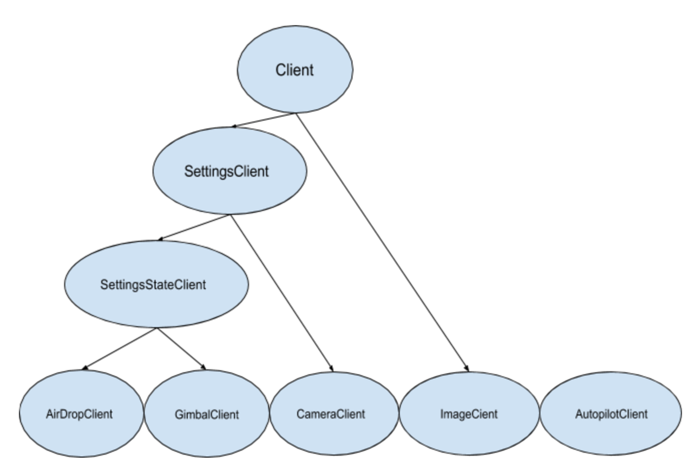

.. CUAir Distributed Systems Documentation documentation master file, created by
   sphinx-quickstart on Mon May  2 11:28:43 2016.
   You can adapt this file completely to your liking, but it should at least
   contain the root `toctree` directive.

Ground Server
============================

.. contents::

This section provides the use and design of the distributed systems ground server.

Overview
----------------

The CUAir ground server is designed to fulfill two tasks: target detection/localization and delivering a care package (airdrop). In order to fulfill these tasks, the ground server must keep track of and store various settings and states. More importantly, it should be able to handle client requests reliably. This document is an explanation of the ground server abstractions, including:

* Models
* Database Accessor Objects
* Client Abstractions
* Controllers

Models
----------------

Below is a class diagram of the ground server models One can see the one-to-one as well as many-to-one relationships (more in next section).

Many-to-One Relationship

.. image:: images/many-to-one-diagram.png

The above figure demonstrates the “one-to-many” relationships between the ground server abstractions. Each image has multiple assignments, which are distributed among various clients, and each assignment can have multiple target sightings.

While this accurately represents the relationship among our abstractions, our software design takes a different approach:

* Target Sighting

  * Assignment

    * Image

* Target Sighting

  * Assignment

    * Image

* Target Sighting

  * Assignment

    * Image

In this approach, we see that there is a “many-to-one” relationship between TargetSighting and Assignment, and between Assignment and Image. The reason we take this approach rather than “one-to-many” is that for one, many-to-one is much simpler and cleaner to serialize into an SQL database. Additionally, this design accurately represents the underlying operations of the ground server. Whether or not TargetSightings are added into an Assignment, Assignment is only concerned with the Image to which it was assigned. Similarly, Image should not bother with Assignments, as it is only concerned with the image data itself.

The ground server models are used to store data in a SQL database through serialization. The ground server utilizes `Ebean <http://ebean-orm.github.io/>`_ to handle this serialization. Ebean is an Object Relational Mapping (ORM), which is a Java library that allows us to execute SQL commands on our database tables.

Database Accessor Objects
-----------------

For each model in the ground server, there exists a database accessor object, or DAO. DAOs utilize Ebean methods to retrieve data from the SQL database. DAOs are an abstraction around accessing the the database from the controller, as many of the methods used to retrieve data are similar across the controllers (get, create, delete, update). The DAO combines these methods into one interface that allows us to handle these requests for any CUAirModel. When we want to make more complicated requests, we can simply extend the DAO and add the necessary method. (i.e. retrieving all target sightings for a certain image). The DAO abstraction is also useful as it prevents us from accessing the database directly. So, if we need to migrate to another ORM or library, we will simply need to modify the DAO rather than the controller code, which would be more complex.

Clients
-----------------

The client abstractions are designed to process requests to get and set settings and state of the plane servers (Gimbal, Camera, Airdrop, Autopilot). Due to the possibility of a failed connection, the client abstractions include threads separate to the application thread that are meant to continue trying to send requests up to the server until a non-timeout response is received.

The underlying pattern with the Client abstractions is that each server on the plane (Gimbal, Airdrop, Camera) contains a client class which handles requests to set the settings, as well as to get the settings and/or state.

ImageClient is a unique case which involves obtaining information from Autopilot and the Gimbal in order to get the telemetry data for a particular image. Since all of the plane servers are on the same onboard computer, they have the same timestamp. This plane timestamp, therefore, can be taken from the Image and used in the queries in AutopilotClient and GimbalClient. ImageClient runs two parallel threads which attempt to get autopilot telemetry data and the gimbal state for an image, respectively.

Client Class Diagram
^^^^^^^^^^^^^^^^^^^

The Client abstraction simply defines a thread that continuously executes run().

The SettingsClient abstraction contains a queue of requests and extends Client. The setSettings() method, which is called by the Client, will add the request to the queue and return a 200 response as an indication that the request was successfully received and is currently being processed. When it is run, it will poll the queue and attempt to send the request (if any) to the server. Once a 200 response is received in the thread, indicating that the settings were successfully sent to the server, the update gets reflected on the front-end. This is extended by CameraClient.

StateSettingsClient, which extends SetttingsClient, allows one to get state. This is extended by AirdropClient and GimbalClient. (`Read more about State vs Settings here <https://docs.google.com/document/d/176vcY3FWgX-kVavf9EOQjFu4cGNpvc62Ek7X_1ly_co/edit/>`_).

AutopilotClient simply gets autopilot telemetry data at a particular timestamp and has no concept of changing the settings or state. Therefore, it is not extended by any client abstractions.

ImageClient is a unique case which involves obtaining information from Autopilot and the Gimbal in order to get the telemetry data for a particular image. Since all of the servers are on the same computer, they have the same timestamp. This timestamp, therefore, can be taken from the Image and queried for in AutopilotClient and GimbalClient. ImageClient runs two parallel threads which attempt to get autopilot telemetry data and the gimbal state, respectively.

Controllers
-----------------

The controller abstractions are meant to interact directly with Java’s Play framework. (`More information on Play specifications can be found here <https://www.playframework.com/documentation/2.5.x/Home/>`_). They utilize the client and dao methods in order to process client requests and return a meaningful response.
